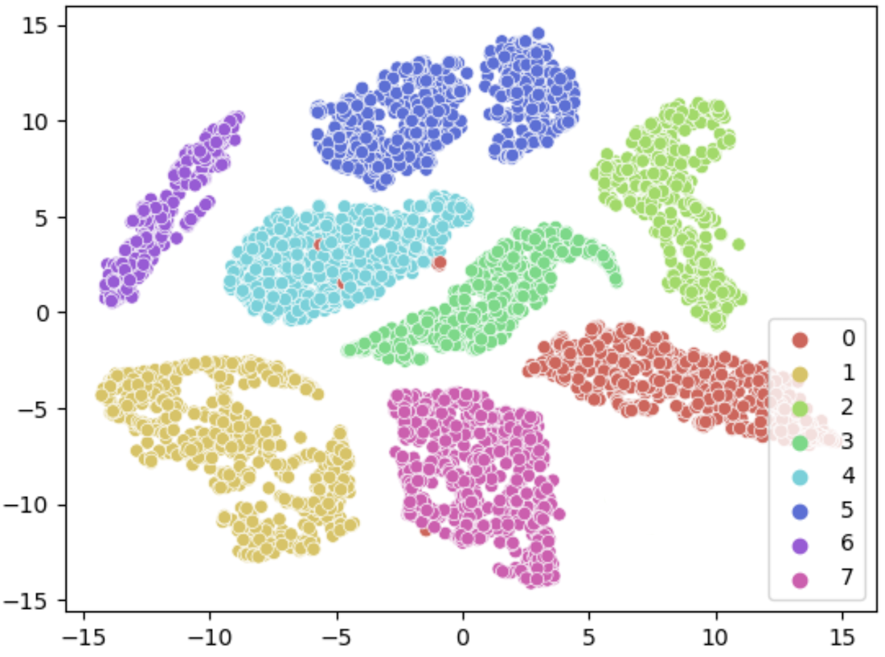
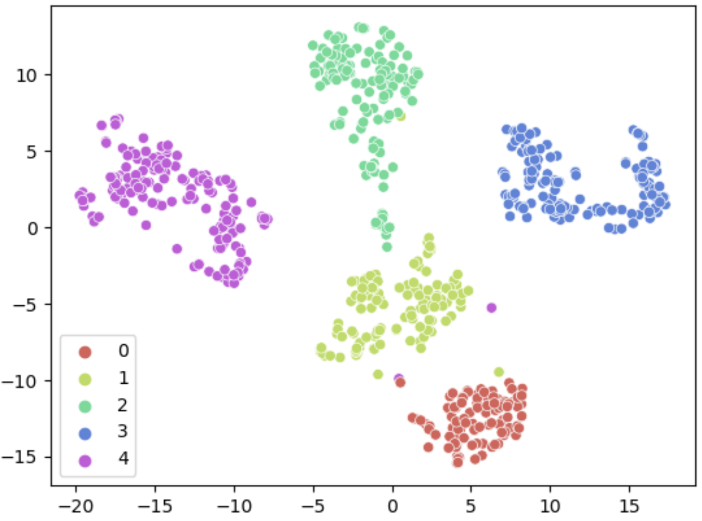
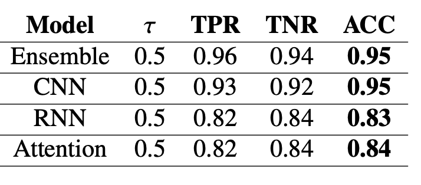
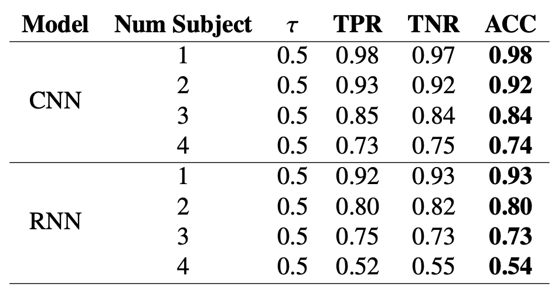

# Open-set-User-and-Speed-Classifier

This repository is the official implementation of Open-set User and Speed Classifier using Few-shot Learning paper, which proposes a framework, which could be used for user and speed identification based on their single gait cycle. The framework consists of two individual networks, to identify user and speed respectively. Both the networks are open-set classifier which uses the concept of few-shot learning, which allows the model to easily learn unseen data from a small sample set and recognize future instances. 

The dataset used for this experiment was recorded in a controlled laboratory environment. Each of the subjects were asked to walk on treadmill at different speeds wearing the in-shoe pressure sensor. The pressure sensor recordings for each subject were segmented into their gait cycles and the subjects were divided into train set, known-test set and unknown-test set. 

For the user classification network an ensemble model consisting of CNN, RNN and Self-head attention network is used, while for speed classification a CNN model is used. The networks were individually trained on the training set, while for few-shot learning, a subset from known-test was used. The remaining data from known-test set and unknown-test set was used for testing.

The framework is tested on various settings, and it shows outstanding performance and accuracy for gait recognition and speed identification was used as the metric for evaluation. The Ensemble model and CNN model are trained using a very small dataset, which makes it efficient to use even with small, labelled training dataset. The few-shot learning utilized for open-set classification require only few gait cycles from each subject to train the decision function, making the classifier work precisely even with less training data, hence solving a major issue of the need of labelled training data.


# Requirements
Some of the main packages used for this project are pytprch 1.12.1, scipy 1.7.3, and scikit-learn 1.0.2.
It is recommended to create a new environment and install the packages listed in requirements.txt:
```
pip install -r requirements.txt
```

# Datasets
As is shown in the following image, the data was collected from 14 subjects and it was split into three sets: 

- <b>Training set</b>: used to train the encoder-decoder network. It consists of all the unit steps of 6 individuals selected randomly.
- <b>Known-test set</b>: it contains the unit steps of 4 individuals selected randomly from the 14 remaining people after selecting the training set. This dataset is divided in two subsets. The first subset consists of 50 unit steps for each individual and it is used for training the classifier. The second subset is the remaining steps of the same 7 individuals and it is used to test the classifier as known data in the open set gait recognition problem.
- <b>Unknown test set</b>: it contains all the unit steps of the remaining 4 subjects which were not used in any training process, therefore they are unknown subjects. It is used for testing the classifier as unknown data in the open set gait recognition problem.


# Processes
The implementation is defined in the jupyter notebook as the following steps:

<b>For User Identification</b>

 - The data is first loaded and split into train, known-test and unknown-test set.
 
 - First using the training set, the ensemble network consisting of CNN, RNN and Self-Attention model is trained for user identification.

 - Using few shot learning and small-subset of known-test set for each subject, the centroid for decision function is calculated for each subject.

 - Now, using the remaining data from known-test set and unknown-test set, the accuracy of the model is tested and reported.

<b>For User Identification</b>

 - Using the input dataset, a random subject is selected to train a CNN model to classify different speeds of the user. 

 - All the data from remaining 15 subjects is used for testing, and accuracy is calculated and reported for the predicted outputs.

The models used are defined in model_class.py, while the modelUtils.py contains the helper functions for training, testing and evaluation of the models.

# Evaluation

For our experiment, the feature vector of unit step of a subject, should be marked close to the other unit steps of the same subject. Hence, the feature vectors which are close to each other, belong to same class, while the ones distant belong to different class. To verify that, we draw t-SNE plot, for the feature vectors generated by the framework for both user and speed classifiers, for known and unknown test set in




The system is evaluated in terms of Accuracy (ACC), True Positive Rate (TPR), and True Negative Rate (TNR) defined as follows:

- 

- 

- 

Where, 
- TP stands for True Positive and it is the total unit steps in the known test set that were classified correctly. 
- FN stands for False Negative and it is the total unit steps in the known test set that were classified incorrectly. 
- TN stands for True Negative and it is the total unit steps in the unknown test set that were classified correctly as an unknown participant.
- FP stands for False Negative and it is the total unit steps in the unknown test set that were classified incorrectly as a known participant.



 

# Results 

The open-set classifier indicates high accuracy of over 95\% for open-set classification of gait recognition, while around 98\% accuracy for speed identification, while the closed-set classifier shows accuracy of 99\% for both user and speed identification.


# Contributors
Apurva Jain apurva.jain@student.csulb.edu <br/>
